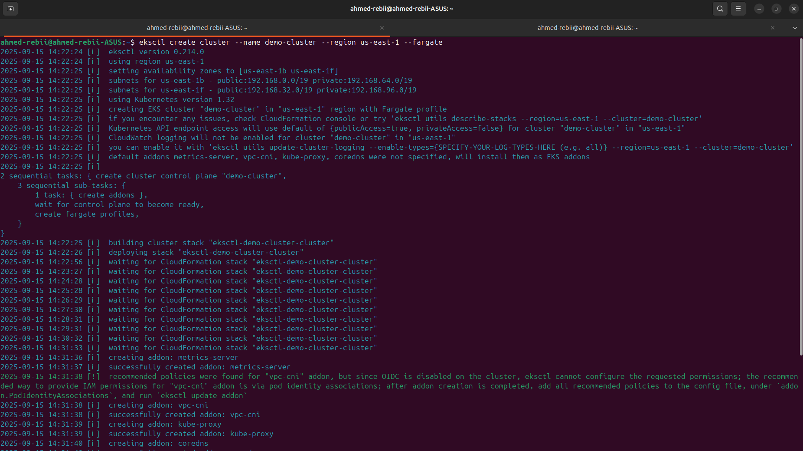
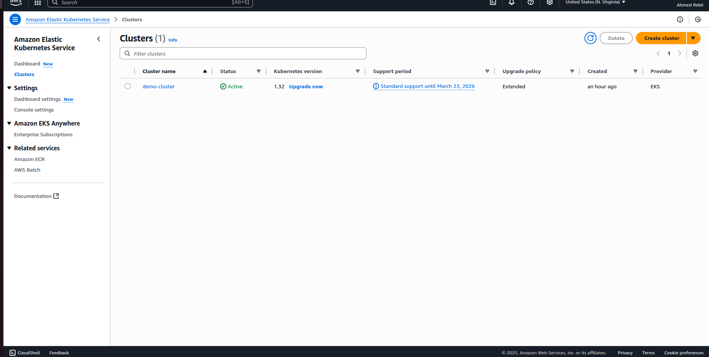
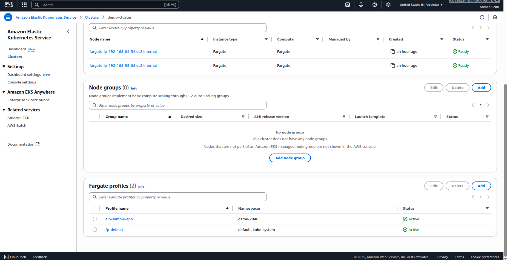
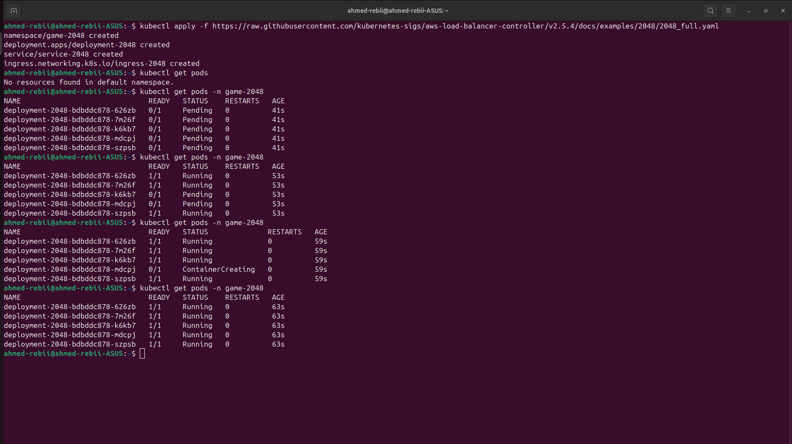
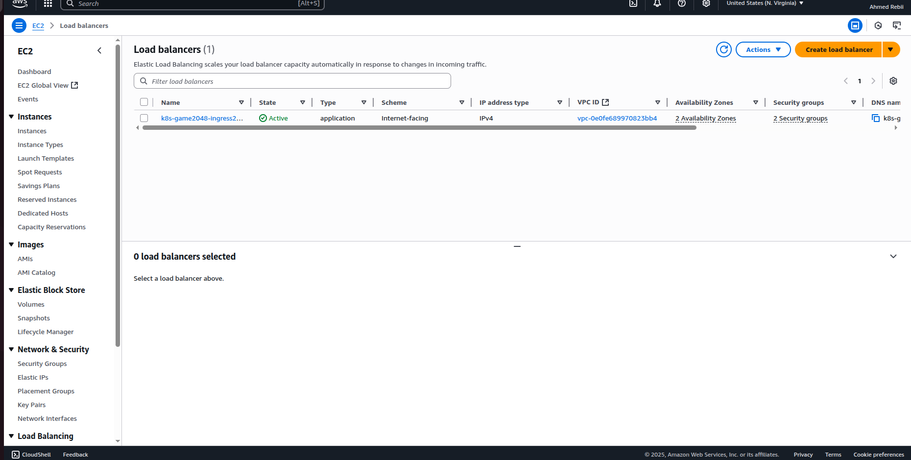
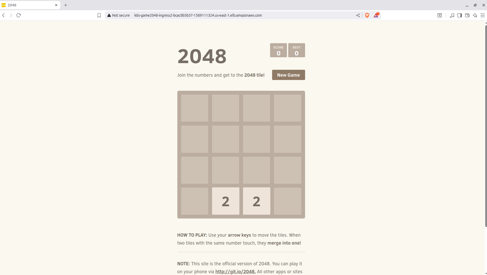

# Deploying an App on EKS with Ingress

  

This project demonstrates how to deploy a **Python 2048 game** on **AWS EKS** using **Fargate** and expose it to the internet with the **AWS Load Balancer Controller**.

---

## 📌 Prerequisites

Before you start, ensure you have installed and configured:

- [kubectl](https://kubernetes.io/docs/tasks/tools/install-kubectl/) – Kubernetes CLI
- [eksctl](https://eksctl.io/) – EKS cluster management CLI
- [AWS CLI](https://docs.aws.amazon.com/cli/) – AWS command-line interface

Configure AWS CLI with your credentials:

<summary>🔧 Configure AWS CLI</summary>

```bash
aws configure 
```

## 🛠️ Deployment Steps

### 1️⃣ Create an EKS Cluster (Fargate)
```bash
eksctl create cluster --name demo-cluster --region us-east-1 --fargate 
```
### 2️⃣ Update kubeconfig
```bash
aws eks update-kubeconfig --name demo-cluster --region us-east-1 
```
### 3️⃣ Deploy the 2048 Sample App
```bash
kubectl apply -f https://raw.githubusercontent.com/kubernetes-sigs/aws-load-balancer-controller/v2.5.4/docs/examples/2048/2048_full.yaml
```

### 4️⃣ Enable IAM OIDC Provider
```bash
curl -O https://raw.githubusercontent.com/kubernetes-sigs/aws-load-balancer-controller/v2.11.0/docs/install/iam_policy.json

aws iam create-policy \
  --policy-name AWSLoadBalancerControllerIAMPolicy \
  --policy-document file://iam_policy.json
```

### 5️⃣ Create IAM Policy
```bash
eksctl create cluster --name demo-cluster --region us-east-1 --fargate 
```

### 6️⃣ Create IAM Service Account
Replace <your-aws-account-id> with your AWS account ID:
```bash
eksctl create iamserviceaccount \
  --cluster=demo-cluster \
  --namespace=kube-system \
  --name=aws-load-balancer-controller \
  --role-name AmazonEKSLoadBalancerControllerRole \
  --attach-policy-arn arn:aws:iam::<your-aws-account-id>:policy/AWSLoadBalancerControllerIAMPolicy \
  --approve
```

### 7️⃣ Install AWS Load Balancer Controller
Replace <your-vpc-id> with your cluster’s VPC ID:
```bash
helm repo add eks https://aws.github.io/eks-charts

helm install aws-load-balancer-controller eks/aws-load-balancer-controller \
  -n kube-system \
  --set clusterName=demo-cluster \
  --set serviceAccount.create=false \
  --set serviceAccount.name=aws-load-balancer-controller \
  --set region=us-east-1 \
  --set vpcId=<your-vpc-id>
```

### 8️⃣ Verify Installation
```bash
kubectl get deployment -n kube-system aws-load-balancer-controller
```

### 9️⃣ Access the App
```bash
kubectl get ingress -A
```
### 🔟 Clean Up Resources
```bash
eksctl delete cluster --name demo-cluster --region us-east-1
```

## 📸 Demo Screenshots

### 1️⃣ EKS Cluster Creation via eksctl
Terminal output showing the `eksctl`  command-line tool creating an Amazon EKS cluster with Fargate in the `us-east-1`region.



---

### 2️⃣ Amazon EKS Cluster Dashboard
View of the Amazon EKS Clusters dashboard showing the active cluster `demo-cluster`.



---

### 3️⃣ EKS Cluster Details and Fargate Profiles
Detailed view of the `demo-cluster` showing two active Fargate profiles for the `game-2048` and `default` namespaces.



---

### 4️⃣ Kubernetes Pods and Ingress Status
Terminal screenshot showing deployment of the 2048 game. `kubectl get pods` shows running pods and `kubectl get ingress` confirms ingress creation.



---

### 5️⃣ EC2 Load Balancer Status
A view of the Amazon EC2 Load Balancers dashboard, showing a single active Application Load Balancer named `k8s-game2048-ingress2...`. 



---

### 6️⃣ The 2048 Game Web Interface
Screenshot of the 2048 game running in a browser via the AWS Load Balancer DNS.



